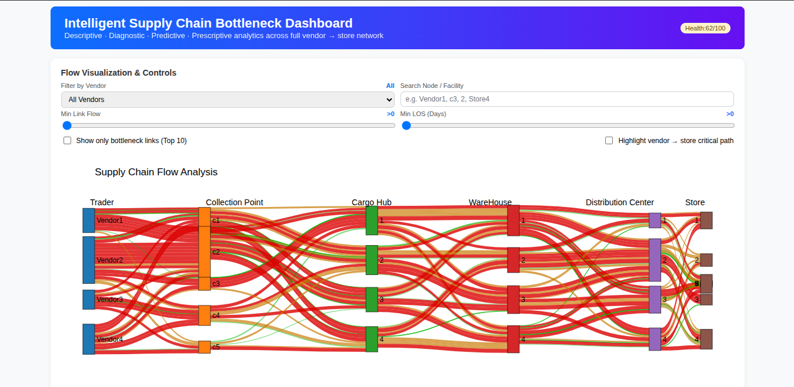
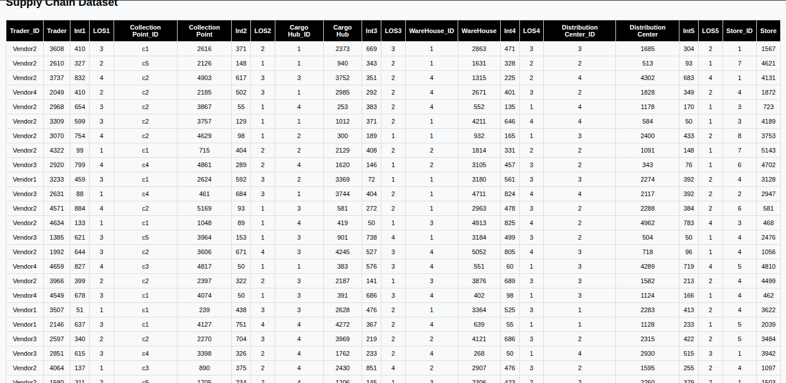

# Intelligent Supply Chain Bottleneck Detection and Optimization System

A data-driven Intelligent Supply Chain Bottleneck Dashboard that visualizes multi-stage product flow, detects congestion using a weighted bottleneck score, predicts LOS with regression, and suggests optimized rerouting using Max-Flow Min-Cut for improved logistics efficiency.

---

## 📌 Features
- Interactive Sankey diagram for full supply chain flow visualization  
- Bottleneck detection using LOS + inverse flow weighted scoring  
- 30-day predictive LOS forecasting (regression-based)  
- Max-Flow Min-Cut optimization for rerouting suggestions  
- KPI scorecards: Efficiency Score, Throughput, Avg LOS  
- Supports custom CSV/XLSX datasets  
- Generates a complete HTML dashboard

---

## 🛠 Tech Stack
- **Python**: Pandas, NumPy, Plotly  
- **Frontend**: HTML + CSS + Plotly.js  
- **Algorithms**:  
  - Weighted bottleneck scoring  
  - Linear regression LOS prediction  
  - Edmonds-Karp Max-Flow Min-Cut

---

## 📁 Project Structure

├── Supply (1).py # Main engine script  
├── synthetic_dataset_50.csv # Sample alternate dataset   
├── sankey_dashboard.html # Final dashboard output   
├── report.pdf # Full project report   
└── README.md   

---

## 🚀 How to Set Up on Any Laptop

### 1️⃣ Install Python
Download Python 3.9+  
https://www.python.org/downloads/

---

### 2️⃣ Create Virtual Environment

**Windows** 
python -m venv venv
venv\Scripts\activate

**Linux/macOS** 
python3 -m venv venv
source venv/bin/activate

---

### 3️⃣ Install Dependencies

Create a `requirements.txt`:
pandas
numpy
plotly

Install:
pip install -r requirements.txt

### Run with custom dataset:
python "Supply (1).py" your_dataset.csv

Example:
python "Supply (1).py" synthetic_dataset_50.csv

The system generates:
sankey_dashboard.html

Open it in any browser.

---

## 📊 Dataset Format

Dataset must include:

Trader_ID, Trader,
Int1, LOS1,
Collection Point_ID, Collection Point,
Int2, LOS2,
Cargo Hub_ID, Cargo Hub,
Int3, LOS3,
WareHouse_ID, WareHouse,
Int4, LOS4,
Distribution Center_ID, Distribution Center,
Int5, LOS5,
Store_ID, Store

---

## 📈 Output Includes

- Sankey Flow Diagram  
- Bottleneck Table (Top 10)  
- Efficiency Score  
- End-to-End LOS  
- Vendor performance analytics  
- Critical path detection  
- Alternate route suggestions  

---

## 🖼  Screenshots 
### 📊 Sankey Flow Diagram

### 📈  Bottleneck & KPI Section 🔥

### 📊 Table

---

## 👨‍💻 Author
**Anshuman Tripathi** 

